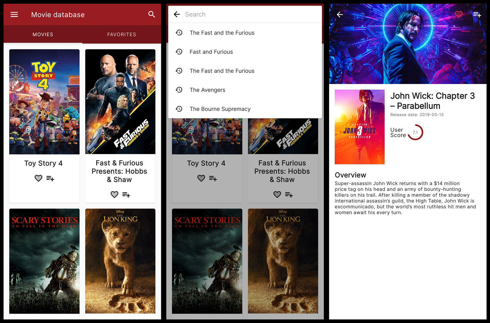

# Movie Database

### Summary: ###
Movie Database is a sample Android application that uses the clean architecture approach and is written in Kotlin.

### The Motivation behind the app: ###
During the work on this app, my goal was put in practice the knowledge I've acquired to make better Android apps takling the some relatively new subjects.

Some of those subjects include:
- The Kotlin programming language
- Clean architecture
- Dagger2
- Android architecture components (ViewModels, LiveData, Room, etc.)

### How to run the app: ###
This app uses [The MovieDB public API](https://developers.themoviedb.org/3/getting-started/introduction).
Register (its free) and grab your API key, 
then paste it inside: `.../core/Config.kt`

### TODO: ###
- Few fixes and teaks
- Add UI tests
- Expand the app functionality

### Used libraries: ###
- [Kotlin Coroutines](https://github.com/Kotlin/kotlinx.coroutines)
- [Retrofit2](https://github.com/square/retrofit)
- [Glide](https://github.com/bumptech/glide)
- [Stetho](https://github.com/facebook/stetho)
- [Timber](https://github.com/JakeWharton/timber)
- [Glide](https://github.com/bumptech/glide)
- [Leakcanary](https://github.com/square/leakcanary)
- [Android architecture components](https://developer.android.com/topic/libraries/architecture/index.html)
- [Room Persistence Library](https://developer.android.com/topic/libraries/architecture/room.html)

### License: ###
~~~~
Copyright 2019 Jose Cardama

Licensed under the Apache License, Version 2.0 (the "License");
you may not use this file except in compliance with the License.
You may obtain a copy of the License at

   http://www.apache.org/licenses/LICENSE-2.0

Unless required by applicable law or agreed to in writing, software
distributed under the License is distributed on an "AS IS" BASIS,
WITHOUT WARRANTIES OR CONDITIONS OF ANY KIND, either express or implied.
See the License for the specific language governing permissions and
limitations under the License.
~~~~
